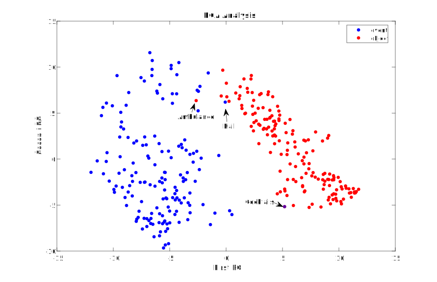

# Large View of Data
This is just a cursurary analysis of the SOE behavioral data (ratings). One of the first things one might look at is how well events and objects are discriminated by the first two principal components alone.

We see that overall there is excellent seperation with only 3 mis-classified words, a2 of which make sense.

The other natural analysis of these groups is through a non-linear dimensionality reduction technique which projects the data in such a way that local groups are maintained

We see that there is excellent seperation and no missclassified words. The next way to color the data is by subgroup. First we can examine how well PCA seperates the subcategories.

We see that while there is some seperation, overall, the categories are not completely linearly seperable. The same coloring with tSNE gives much better results.

# Correlation Among Ratings
There are 65 dimensions to the data, and we might want to look at how indepedent the dimensions are. We can grossly asses this through correlation histogram (there are roughly 2,000 pairwise correlations)

We see that there is roughly normal distribution with very few columns perfectly correlated, and most having no correlation. A natural extension to this would be to look at the mutual information across all coloumns, but this analysis is not native to matlab.

# Most discriminating Features: Super Category
Since PCA performed very well at seperating the categories, we expect that there is a linear decision boundary which (almost) perfectly seperates the space. As such, there is no added benefit to more advanced methods.

# Single Feature Analysis
We can see which features are most discriminating between objects and events using only a single threshold value. The top 10 singularly most discriminating features are:

| Feature  | Accuracy |
|----------|----------|
| Texture  | 0.96     |
| Pattern  | 0.95     |
| Weight   | 0.94     |
| Caused   | 0.94     |
| Shape    | 0.94     |
| Short    | 0.92     |
| Touch    | 0.88     |
| Arousal  | 0.88     |
| Duration | 0.86     |
| Color    | 0.82     |

The corresponding distributions of the top 5 single features are shown below:

In considering all the features, we can look at overall accuracy of any 1 feature, the histogram of which is shown below

We see than on average, any 1 feature has 70% accuracy (where guessing is 50%)

# Multiple Feature Analysis
In training a linear discriminant model, we know that only 1 word is miss-classified. For a linear discriminant model trained on all the features, we can see which features have the highest weights. The best weights with their associated singular accuracies are:

| Feature    | B Value | Individual Accuracy |
|------------|---------|--------------|
| Long       | 8.19    | 0.79         |
| Pleasant   | 7.75    | 0.76         |
| Benefit    | 6.62    | 0.48         |
| Happy      | 6.41    | 0.68         |
| Short      | 6.03    | 0.70         |
| Audition   | 4.28    | 0.62         |
| Duration   | 4.08    | 0.82         |
| Disgusted  | 3.83    | 0.61         |
| Unpleasant | 3.74    | 0.65         |
| Pattern    | 3.59    | 0.52         |

It is important to note that for a linear discriminate model, these features are not indepedent, and these features are likely all strongly correlated. 

We can also look at the histogram of the absolute value of the 65 $$beta$$-weights

We can train a linear classifier on the top *k* features of the whole model and look at how accuracy changes as more features are added

We see that after 10 features are included (the ones above), there is no added benefit to more features. I thought this was interesting and found that this was actually a general trend where almost **any** group of 10 features gets you to near 100% accuracy.

